# Documentación técnica — PreciosEC (ract_comparador)

>## 1. Resumen del proyecto y arquitectura

**PreciosEC** es una aplicación web de comparación de precios entre comercios 
ecuatorianos (supermercados, farmacias y ferreterías), construida en React 
y TypeScript sobre una API real ya existente en Django REST Framework. 

El proyecto existía previamente como una aplicación móvil en Flutter 
("Kache"), y esa versión se usó como referencia funcional durante el 
desarrollo — principalmente para confirmar el comportamiento esperado de 
ciertas pantallas y para identificar comportamientos que, aunque presentes 
en esa versión, no eran decisiones de diseño deliberadas sino limitaciones 
sin resolver (ver más abajo, "paridad funcional intencional, no paridad de 
defectos"). Pero el foco de este trabajo no fue traducir código de un 
framework a otro: fue construir una aplicación web con criterio propio, 
tomando decisiones de diseño y arquitectura pensadas específicamente para 
el contexto de una app web real, no solo replicando lo que ya existía.

### Por qué la misma experiencia en móvil y escritorio

Una decisión de diseño central, tomada temprano en el proyecto: la 
aplicación debía comportarse de forma consistente tanto en un celular como 
en una pantalla de escritorio ancha, con la misma funcionalidad completa 
en ambos casos — no dos experiencias divergentes según el dispositivo.

Esto no es la solución más simple ni la más rápida de construir. Es común 
en productos reales que la versión web y la versión móvil terminen siendo, 
en la práctica, dos productos distintos: funciones que existen en una pero 
no en la otra, un usuario que aprende a usar la app en su celular y se 
siente perdido al abrirla en la computadora de su oficina, o un equipo que 
termina manteniendo dos experiencias por separado con el doble de esfuerzo. 
Se decidió evitar ese camino desde el principio: un único código base, con 
un mismo conjunto de funcionalidades, adaptando solo el *layout* (cómo se 
organiza visualmente el contenido: navegación inferior en móvil vs. barra 
superior en escritorio, columnas que se reorganizan según el ancho 
disponible) sin que eso signifique nunca ocultar o degradar una función 
según el dispositivo.

Esta decisión se sostuvo de forma consistente en cada bloque de trabajo 
responsive documentado en la cronología de abajo: cada pantalla adaptada a 
escritorio (Home, Catalog, Precios, Mi Lista, etc.) mantuvo exactamente las 
mismas funciones que su versión móvil, cambiando únicamente cómo se 
distribuye el espacio.

### Stack

- React 19 + TypeScript 6 + Vite 8
- Tailwind CSS v4 (`@import "tailwindcss"`, utilidades vía `@layer`, Lightning CSS como minificador de producción)
- Zustand 5 para estado global (un store por dominio: `auth`, `producto`, `precio`, `categoria`, `comercio`, `comparador`)
- React Router 7
- `@react-oauth/google` para login con Google
- `axios` como cliente HTTP

### Arquitectura por capas

El proyecto sigue una arquitectura limpia explícita, con una carpeta por capa dentro de `src/`:

```
domain/           entidades, puertos (interfaces), enums, servicios de dominio puros
  entities/       Producto, Precio, ComercioLigero, ListaComparacion, LoggedUser...
  ports/          interfaces que la infraestructura debe implementar (ej. ComparadorRepository)
  services/       lógica de dominio sin dependencias externas (ej. buscar-productos, filtrar-subcategorias)

application/      casos de uso — un archivo por acción de negocio (CrearListaUseCase, EliminarListaUseCase...)
  use-cases/      orquestan uno o más puertos; no conocen HTTP ni React
  dtos/           tipos de entrada/salida de casos de uso

infrastructure/    implementación concreta de los puertos
  adapters/       *-http.adapter.ts — mapean el JSON real del backend (snake_case) a las entidades de dominio (camelCase)
  factories/      instancian adapters + casos de uso y los exponen como un objeto único (ej. comparadorUseCases)
  http/           cliente axios configurado, manejo de tokens
  storage/        localStorage tipado

presentation/      React
  store/          Zustand — un store por dominio, consume los casos de uso vía factories
  pages/           una carpeta por sección (auth, catalog, cart, profile, landing)
  components/      componentes compartidos entre páginas (ProductoCard, TarjetaPrecioDestacado, AuthHeroPanel...)
  theme/           constantes de color/tema (brand.theme.ts, tipo-comercio.theme.ts, comercio-brand.theme.ts)
  router/          app-router.tsx (shell + rutas) y main-layout.tsx (nav autenticada)
```

El patrón se repitió de forma consistente en cada feature nueva: **puerto → adapter → caso de uso → store → UI**, verificando primero contra el backend real con `curl` antes de escribir cualquier código que dependiera de la forma de los datos. Esta disciplina de "verificar antes de construir" aparece una y otra vez en la cronología de abajo, y varias veces cambió el alcance de lo que se construyó (ver §5).

### Convenciones notables

- **Todo en español** para nombres de dominio, stores, componentes de página (`MiListaPage`, `comparadorUseCases`, `eliminarLista`) — solo los nombres de archivos y algunos términos técnicos genéricos quedan en inglés.
- **Fallback defensivo repetido**: cualquier `` que dependa de una URL externa (imagen de producto, logo de comercio) tiene su propio `useState` de error y cae a un emoji si la carga falla — patrón replicado en `ProductoCard`, `ComercioTile`, `PrecioCard`, `ComercioChip`, `ComercioGrupo`.
- **Verificación real, no confianza ciega**: prácticamente ninguna feature de esta cronología se construyó sin antes correr `curl` contra el backend en producción para confirmar forma de datos, códigos de estado, o disponibilidad de un método HTTP.

---

## 2. Advertencia sobre el alcance de este documento

Este repositorio tiene historial de trabajo **anterior** al que este documento puede narrar con detalle. Durante la redacción se encontraron capturas de pantalla guardadas (`D:\tmp_claude_verify\shots\`) fechadas antes del inicio de la ventana de contexto disponible — por ejemplo, capturas de Mi Lista con productos (`milista-*.png`), del flujo de comparar múltiples listas (`multi-*.png`, `popup-*.png`), de Perfil (`profile-*.png`), de ofertas (`oferta-*.png`), de delivery por ítem (`delivery-peritem-*.png`), y de la paginación temprana de Catalog/Explorar (`recorrido-*.png`, `explorar-timing*.png`, `catalog-pagination-final.png`).

**No se documentan esos bloques en detalle** porque no hay registro disponible de qué se decidió, qué alternativas se consideraron, o qué bugs aparecieron durante esa parte del trabajo — solo existe la imagen final. Enumerarlos igual, sin ese contexto, sería presentar una reconstrucción especulativa como si fuera un hecho documentado, que es exactamente lo que este documento busca evitar. Si se necesita esa historia, hay que reconstruirla desde `git log` con más profundidad que la que este documento cubre, o desde quien haya estado presente en esas sesiones.

Lo que sigue documenta, en orden cronológico real, los bloques de trabajo de los que sí hay contexto completo: decisiones, alternativas descartadas, bugs con causa raíz, y verificación concreta.

---

## 3. Cronología

### 3.1 Login con Google — tres intentos hasta llegar a la versión estable

**Pedido inicial**: agregar "Continuar con Google" en Login y Register, contra un endpoint real `POST /api/auth/google/` ya construido en el backend, con un Client ID de Google ya emitido.

**Intento 1 — `<GoogleLogin>` estándar de `@react-oauth/google`.**
Funcionaba, pero el botón mostraba directamente "Acceder como [Nombre]/[email]" en vez de un botón genérico, porque el navegador ya tenía sesión de Google activa (comportamiento de FedCM, Federated Credential Management).

| Login | Register |
|---|---|
| 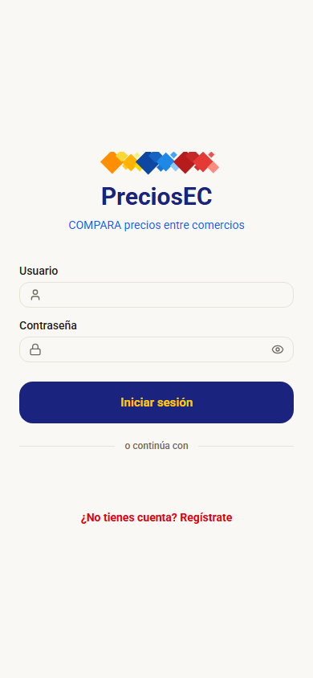 | 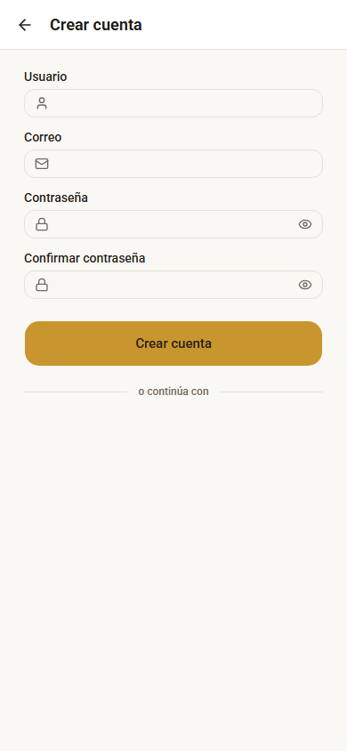 |

**Intento 2 — cambiar a `useGoogleLogin` (hook OAuth2 en vez del componente).**
Se descartó **antes de escribir código**, verificando directamente los tipos reales en `node_modules/@react-oauth/google/dist/index.d.ts`: `useGoogleLogin` solo puede devolver `access_token` o `code` (flujo OAuth2), nunca un `id_token` (JWT / OpenID Connect). El endpoint del backend (`POST /auth/google/`) espera exactamente un `id_token`. Cambiar de hook habría roto el login por completo. Se decidió no proceder por esta vía — la alternativa fue verificada como *imposible*, no solo indeseable.

**Intento 3 — botón visual propio + overlay invisible del `<GoogleLogin>` real detrás.**
La idea: dibujar un botón "Continuar con Google" con el estilo deseado, y superponer el iframe real de Google de forma invisible encima para capturar el click. Visualmente indistinguible del botón final (por diseño, la técnica buscaba justamente eso):

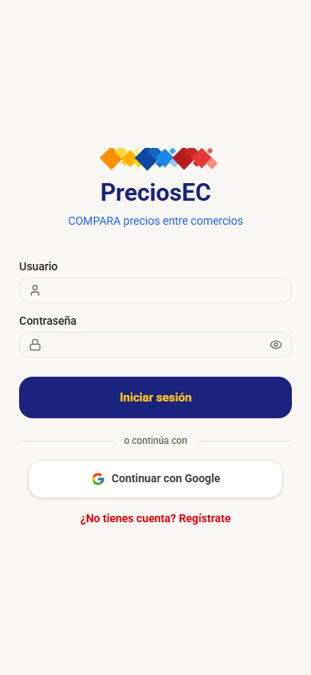

Se abandonó tras reporte de bugs reales en navegador (no en Playwright, que no pudo probarlo — ver limitaciones más abajo):
- El botón no respondía al click.
- El link "¿No tienes cuenta? Regístrate" dejó de funcionar.

Causa raíz teorizada (no se pudo reproducir el segundo bug de forma aislada en Playwright): el overlay invisible, al ser un iframe de cross-origin posicionado con CSS encima del botón, terminaba interceptando eventos de puntero (`intercepts pointer events`) en un área más grande de la esperada, tapando elementos vecinos.

**Solución final — `<GoogleLogin>` real y visible, con `use_fedcm_for_button={false}`.**
Se volvió al componente real (sin overlay), y se desactivó explícitamente FedCM para el botón, forzando el popup clásico de selección de cuenta de Google en vez del selector nativo del navegador que exponía el nombre/email:

| Botón final (genérico) | Popup clásico al hacer click |
|---|---|
|  | 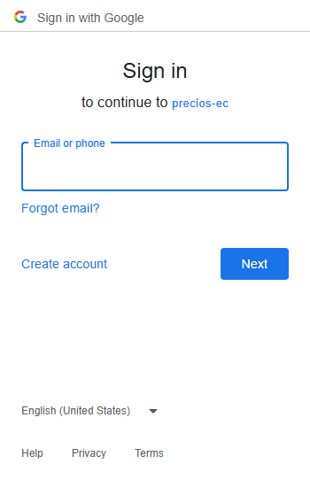 |

Verificado con Playwright confirmando que la URL del popup contenía `prompt=select_account&response_type=id_token` (es decir, realmente es el flujo clásico, no FedCM).

**Verificación de los dos bugs reportados, tras volver al botón real**:

| Login | Register | Vuelta a Login |
|---|---|---|
| 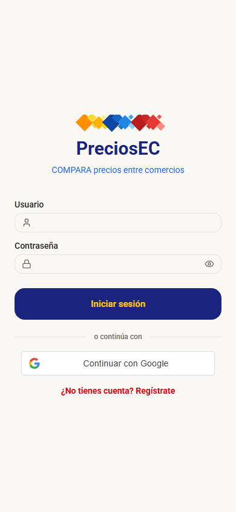 | 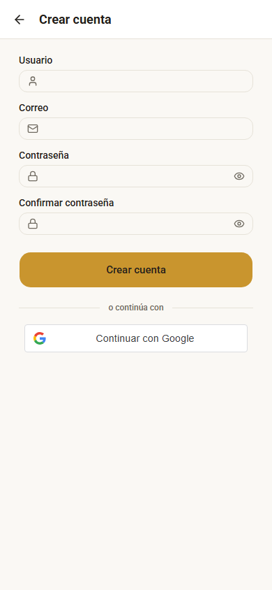 |  |

**Limitación permanente de testing**: Playwright no puede completar un login de Google real — Google detecta y bloquea activamente flujos automatizados (`FedCM get() rejects with NetworkError`, `origin not allowed`, incluso con la configuración corregida). Esto no es un bug de la app; es una limitación de herramienta que se documentó explícitamente para no perseguirla como si fuera un problema propio.

### 3.2 CI/CD — `npm ci` → `npm install`

Cambio de una sola línea en `.github/workflows/deploy.yml`. Sin capturas (no aplica).

### 3.3 Bottom nav "flotando" — dos intentos, causa raíz distinta a la sospechada

**Síntoma reportado**: en mobile, el bottom nav (`fixed inset-x-0 bottom-0`) no se mantenía pegado al fondo real de la pantalla, apareciendo flotando en medio del contenido al hacer scroll.

**Intento 1 — sospecha inicial: unidades de viewport.**
Hipótesis: `h-svh` asume que la barra de direcciones del navegador móvil está siempre expandida y no se recalcula cuando se oculta al hacer scroll; `dvh` sí se recalcula en vivo. Se cambió a utilidades `h-viewport-dinamico`/`min-h-viewport-dinamico` con fallback en cascada `svh → dvh` vía `@supports`.

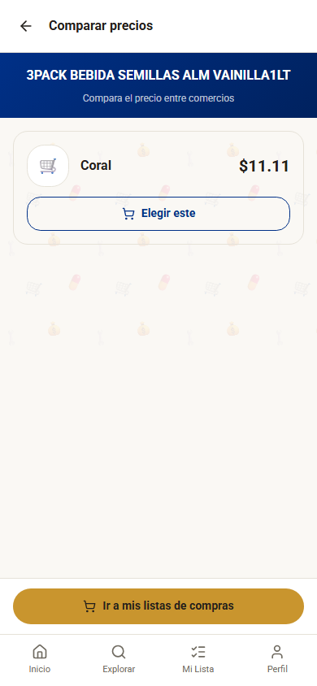

**Causa raíz real, encontrada después**: doble scroll. El elemento `fixed` estaba anidado dentro de un contenedor que *también* scrolleaba, y su "containing block" (establecido por un ancestro con `transform`) coincidía con ese mismo contenedor scrolleable — el navegador entonces trataba el `fixed` como si fuera `absolute` dentro del contenido, moviéndolo junto con el scroll en vez de dejarlo pegado al viewport real. Confirmado con medición directa: `getBoundingClientRect()` del nav se corría exactamente lo mismo que el `scrollTop` del contenedor.

**Fix real**: `html, body { height: 100%; overflow: hidden; }` en el CSS global, eliminando el scroll doble. Verificado en Home, Precios y Explorar:

| Mobile — Catalog | Desktop — Catalog |
|---|---|
| 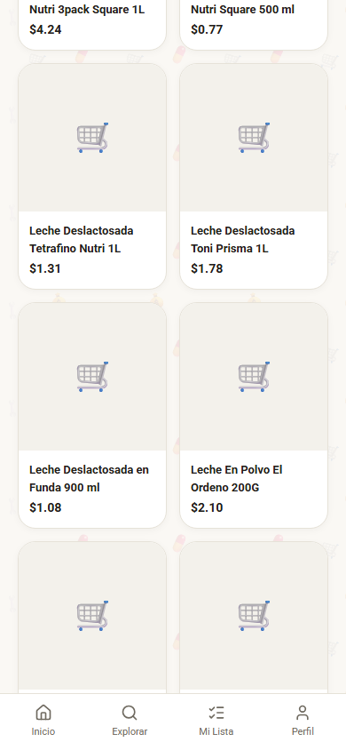 | 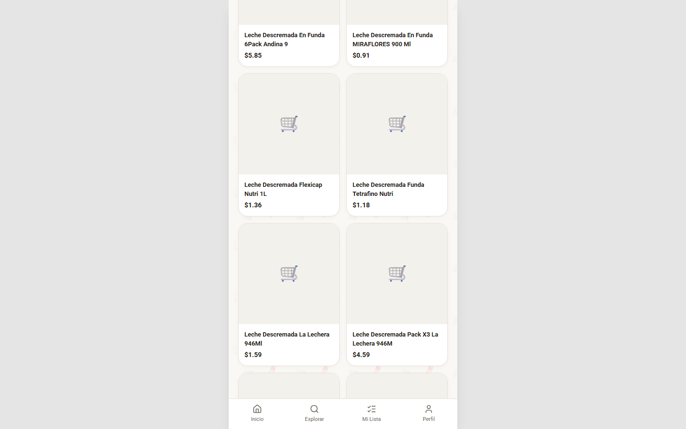 |

Este mismo problema de "containing block que también scrollea" reaparecería más adelante (§3.9) al construir el layout responsive de escritorio, y la solución arquitectónica definitiva (separar en dos `div` anidados) se construyó ahí — este primer fix con `overflow: hidden` en `html/body` fue el parche correcto para el problema *tal como existía en ese momento*, antes de que el shell tuviera que soportar además una navbar superior de escritorio.

### 3.4 Explorar por Comercio (feature nueva)

Antes de construir, se verificó con `curl` que el backend soportaba `GET /kache/precios/?comercio=<id>` como filtro — de haber sido negativo, el plan explícitamente decía "detente y decime qué parámetros acepta hoy". El filtro existía, así que se construyó la feature completa: puerto/adapter/caso de uso/store (`listarPorComercio`, con el mismo patrón de paginación infinita ya usado en Catalog) y dos vistas (grilla de comercios → detalle con productos de ese comercio).

| Grilla de comercios | Detalle de un comercio | Scroll infinito de precios |
|---|---|---|
| 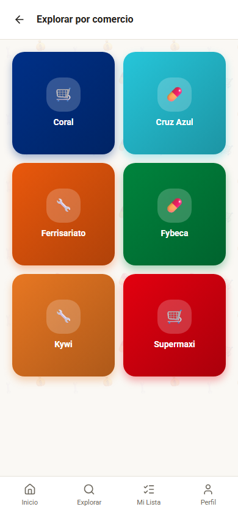 | 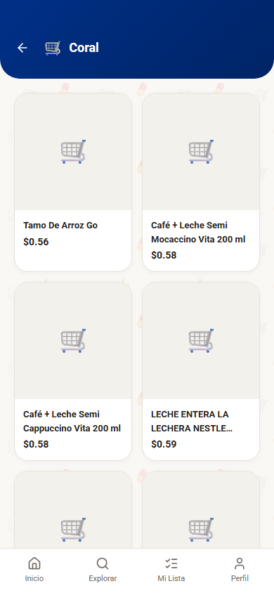 | 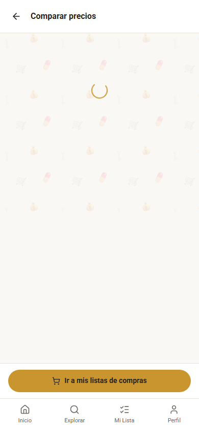 |

### 3.5 Landing page pública

Reemplazo de la redirección directa a Login para usuarios no autenticados por una landing de marketing real, con estadísticas reales del backend (conteo de productos/comercios verificado con `curl`, no inventado).

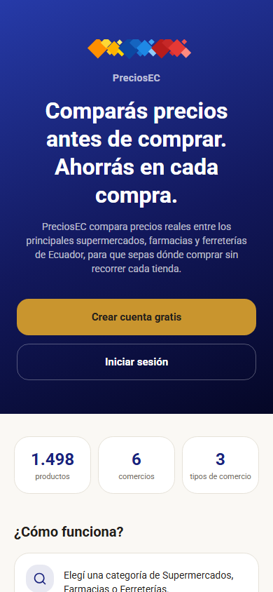

### 3.6 Fundación del layout responsive (bloque 1)

Antes de este bloque, la app se veía en desktop como una tarjeta de teléfono flotando en el centro de la pantalla (ver capturas de la verificación del fix de doble scroll, que casualmente ya mostraban ese estado):

| Home en "modo tarjeta" — desktop | Home en "modo tarjeta" — mobile |
|---|---|
| 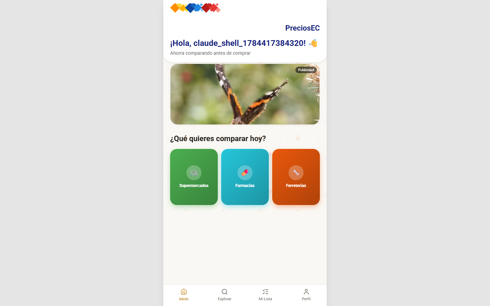 | 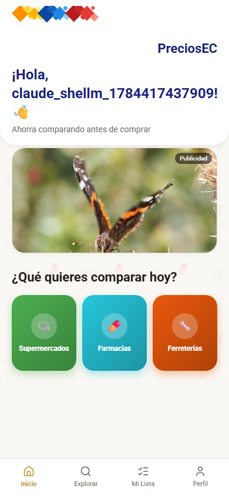 |

Se introdujo el breakpoint `lg:` (1024px): por debajo, la app sigue siendo la tarjeta de teléfono de siempre (`max-w-[480px]`, bottom nav); por encima, el shell pasa a ocupar el viewport completo con una navbar superior fija en vez de bottom nav, y el contenido se acota a `max-w-7xl` un nivel más adentro (en `main-layout.tsx`, no en el shell, para no afectar a Login/Register/Landing).

Explícitamente **no se tocó el contenido interno de cada pantalla en este bloque** — por eso las capturas de verificación muestran la navbar de escritorio ya funcionando, pero el contenido de Home todavía con el aspecto de mobile estirado (categorías gigantes, header duplicado):

| Mobile (390px) | Desktop (1440px) — solo el shell cambió |
|---|---|
| 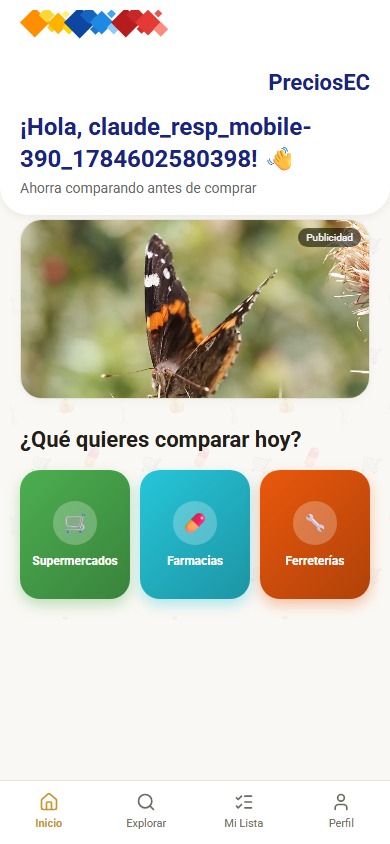 | 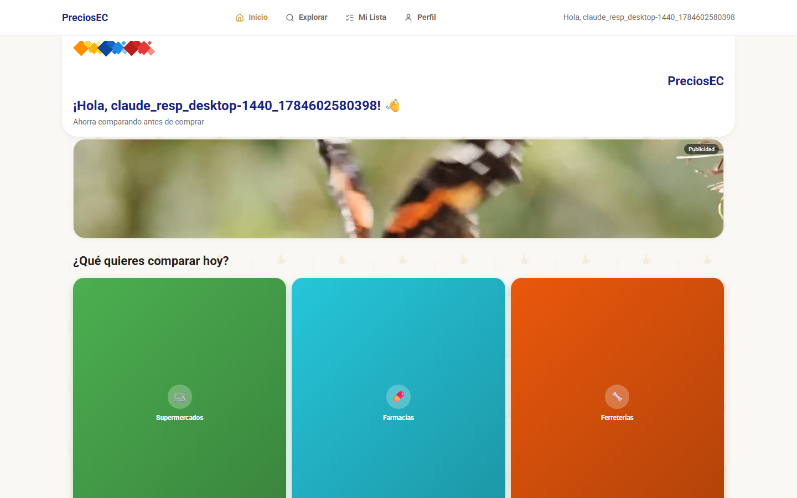 |

Se re-verificó que el fix de containing-block seguía funcionando con ambos modos de navegación, incluyendo scroll profundo en Catalog:

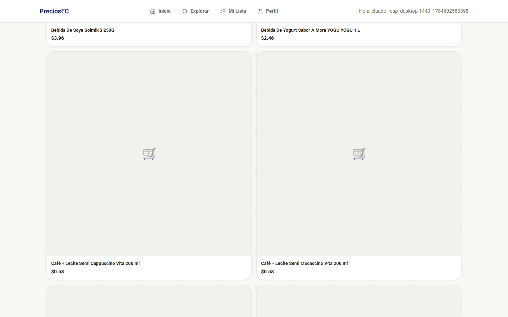

### 3.7 Rediseño visual de la landing (bloque 2)

Paleta navy (`#12185C` → `#050726`) + mint (`#00D9A3`) como identidad propia de la landing, tipografía "Space Grotesk" (Google Fonts, cargada solo para esta pantalla), hero asimétrico con una tarjeta animada de comparación de precio usando **datos reales**: se verificó con `curl`, cruzando precios entre los 6 comercios, que el producto id `224` era el único caso con 2 comercios reales — no se inventó ni se simuló.

| Mobile | Desktop — hero | Desktop — sección intermedia |
|---|---|---|
| 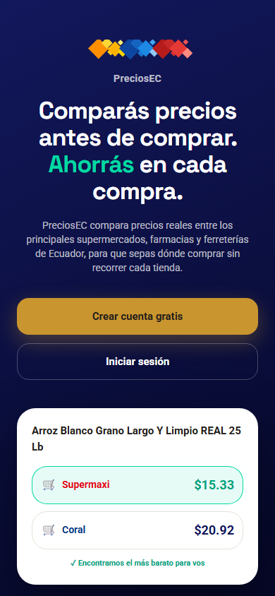 | 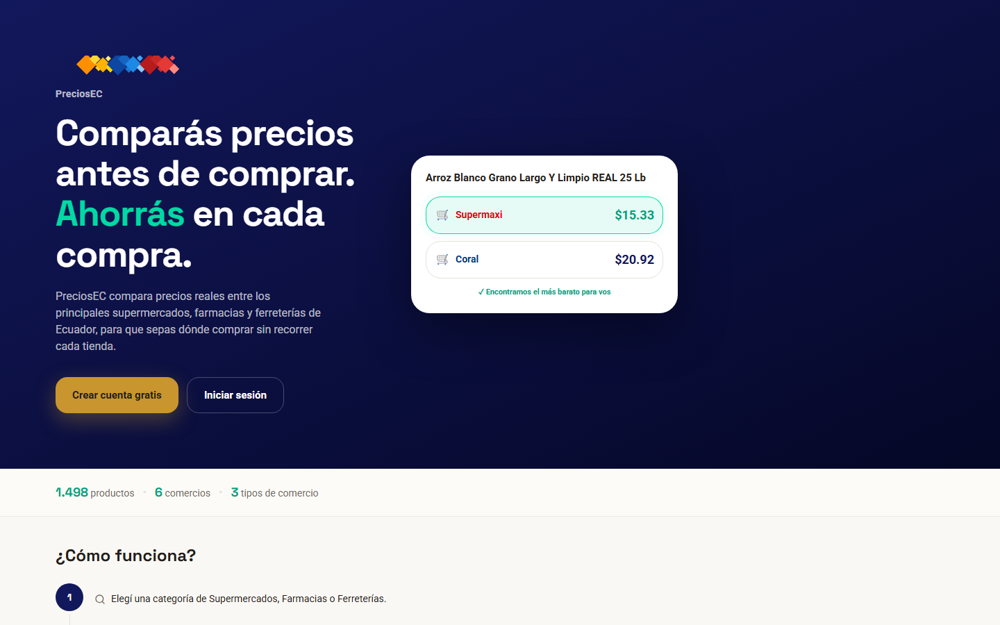 | 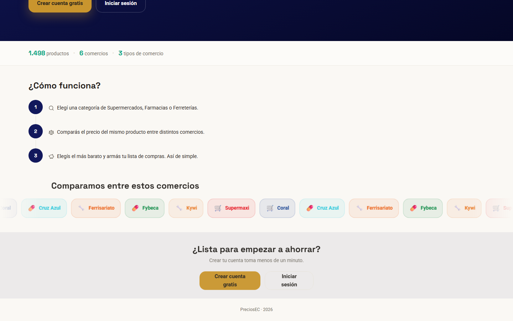 |

### 3.8 De marquee continuo a entrada en cascada

La sección de comercios de la landing usaba inicialmente un marquee CSS de scroll infinito (lista duplicada + `@keyframes translateX`). Se revirtió esa decisión cuando se hizo evidente que, con solo 6 comercios reales, todos entran en una sola fila sin necesidad de scroll — el movimiento continuo no aportaba información, era ruido visual.

Se reemplazó por una entrada en cascada (stagger): un único `IntersectionObserver` por sección (reutilizando el hook `useRevealOnScroll` ya existente) más un `transition-delay` incremental por cada chip (70ms de diferencia), en vez de instanciar un observer por elemento. Se eliminó el código muerto del marquee (keyframes, clase, duplicación de la lista) explícitamente para no dejarlo huérfano.

| Mobile | Desktop | Con `prefers-reduced-motion` |
|---|---|---|
| 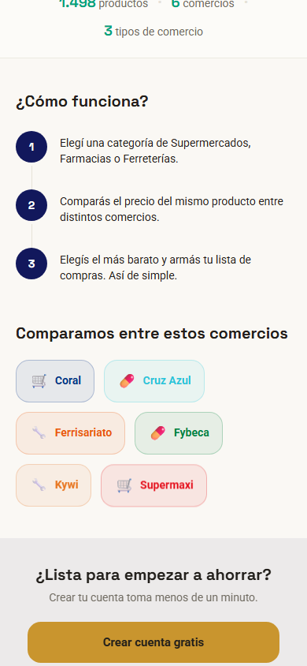 |  | 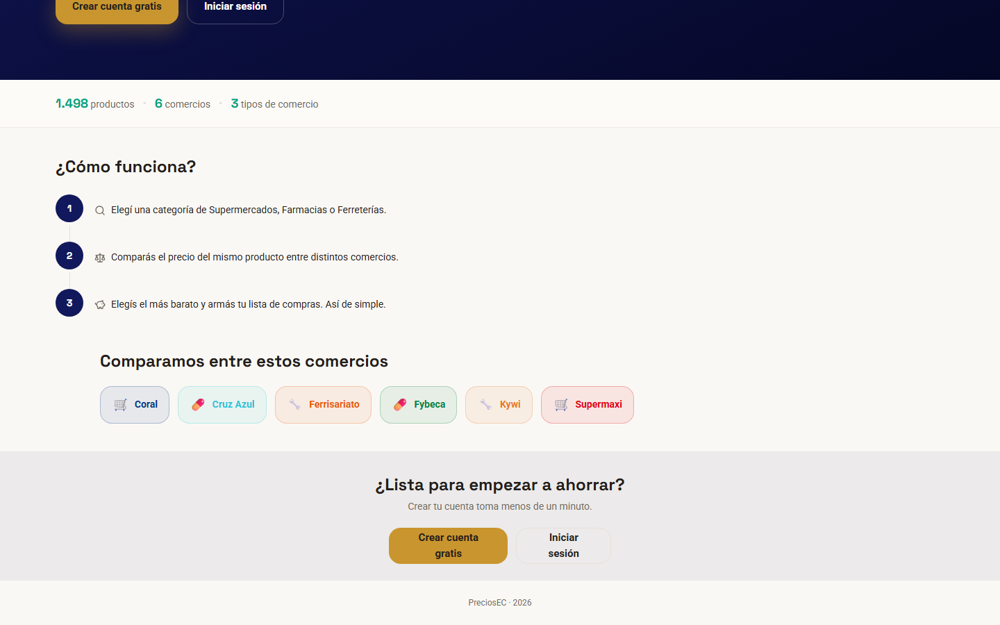 |

Verificado también que forzar que las imágenes de logo fallen (interceptando la red) hace caer correctamente al emoji, sin animación, cuando `prefers-reduced-motion: reduce` está activo.

### 3.9 Home adaptado a desktop (bloque 3)

Tres problemas puntuales, corregidos todos con clases `lg:` sin tocar el comportamiento mobile:

1. **Wordmark duplicado**: "PreciosEC" aparecía tanto en la navbar superior (bloque 1) como en el header interno de Home. Se ocultó el header interno en `lg:hidden`, dejando solo el saludo como título de página en desktop (sin repetir el wordmark).
2. **Video de anuncio desproporcionado**: se estiraba a los 1280px completos con solo 180px de alto. Se pasó a `lg:aspect-video` dentro de una columna fija de 360px junto a las categorías.
3. **Tarjetas de categoría gigantes**: heredaban `aspect-[0.85]` de mobile. En desktop pasan a `lg:h-24 lg:flex-row` (ícono + label horizontal, altura fija), en un grid de 2 columnas (`grid-cols-[1fr_360px]`) junto al video.

| Mobile (idéntico a antes) | Desktop (rediseñado) |
|---|---|
| 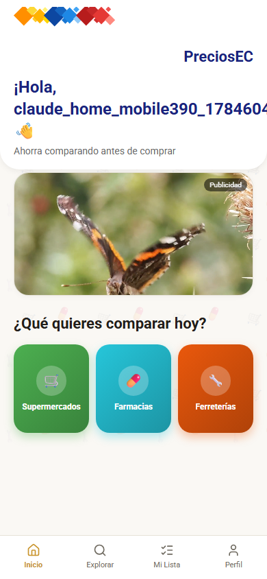 | 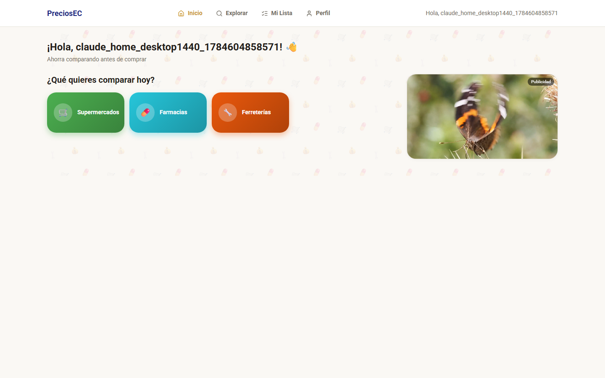 |

### 3.10 Catalog, Subcategoria, Explorar y Explorar por Comercio adaptados a desktop (bloque 4)

Mismo criterio: grid de 2 columnas en mobile sin cambios, más columnas en desktop (`lg:grid-cols-4/5/6` según la pantalla), headers con degradado de color reducidos de banner-de-status-bar-móvil a una píldora compacta. En Explorar, los resultados de búsqueda **no** se convirtieron en grilla — se mantuvieron como lista vertical acotada a `max-w-2xl`, con la siguiente justificación: cada fila ya es un layout horizontal (ícono + nombre + precio + flecha) pensado para lectura izquierda-a-derecha; forzarlo a columnas lo hubiera fragmentado.

| Catalog — mobile | Catalog — desktop (5 columnas) | Explorar por Comercio — desktop (6 en una fila) |
|---|---|---|
| 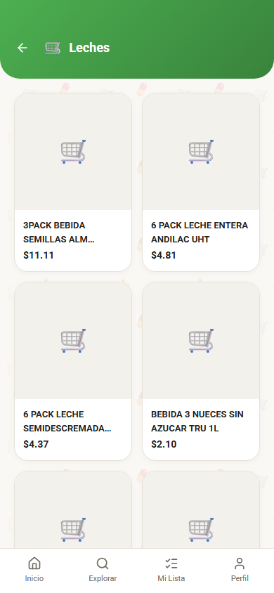 | 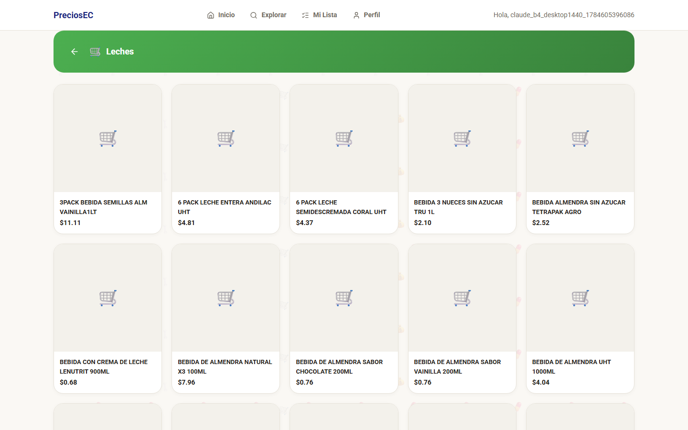 | 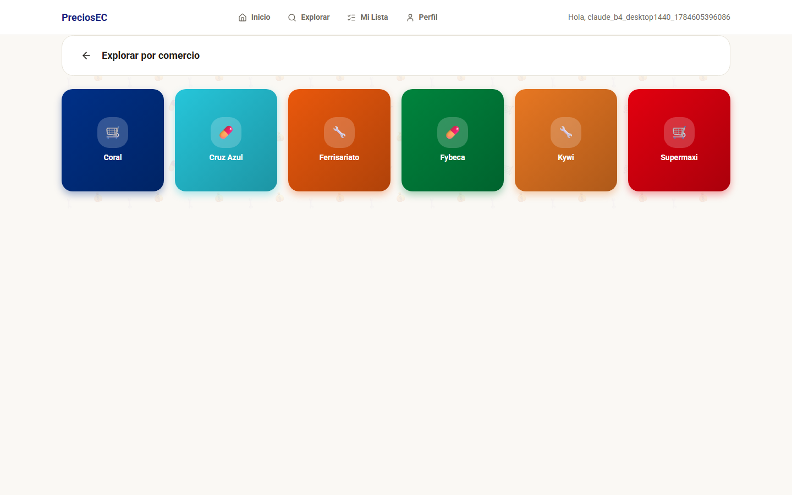 |

**Hallazgo colateral durante la verificación**: al scrollear profundo en Explorar por Comercio → Coral, apareció un warning de React de key duplicada. Se investigó con un script que recorría las 12 páginas reales de `/kache/precios/?comercio=1` — confirmó que `id_precio=17` aparece tanto en la página 5 como en la página 6 del backend (paginación por offset sin orden 100% estable). Se corrigió del lado del cliente con una deduplicación defensiva por `id` al acumular páginas (`dedupeById`, en `precio.store.ts` **y** `producto.store.ts`, ya que ambos comparten el mismo patrón de paginación infinita — el pedido original mencionaba solo un archivo, pero el bug estaba presente en los dos). Verificado recorriendo las 12 páginas hasta el final: 235 tarjetas únicas de 236 reportadas por el backend (236 − 1 duplicado conocido), 0 warnings.

### 3.11 Logos reales de comercio — un vaivén con dos iteraciones

**Primer intento**: mostrar el logo real de cada comercio (campo `logo_url`, recién poblado en el backend) dentro de una placa con el **color de marca** del comercio, en vez del chip de color + emoji genérico usado hasta entonces.

Antes de construir se verificó con `curl` — y se encontró una inconsistencia real y momentánea del backend: el endpoint de **lista** (`/kache/comercios/`) devolvía `logo_url: null` para los 6 comercios, mientras que el endpoint de **detalle** (`/kache/comercios/<id>/`) y los objetos embebidos en `/kache/precios/` sí traían URLs reales. Se le reportó esto al usuario explícitamente antes de continuar; para cuando se retomó la verificación en navegador, el backend ya se había actualizado y el endpoint de lista también devolvía logos reales — la discrepancia fue transitoria (deploy en curso), no un bug a resolver del lado del frontend.

**Bug real encontrado tras la primera implementación**: usar el color de marca como fondo de placa para *todos* los logos causaba que el de Supermaxi (texto rojo) quedara casi invisible sobre su propia placa roja — el logo ya tenía color propio, coincidente con el color de marca.

| Antes — placa de color para todos (Supermaxi ilegible) | Después — placa blanca por defecto |
|---|---|
|  | 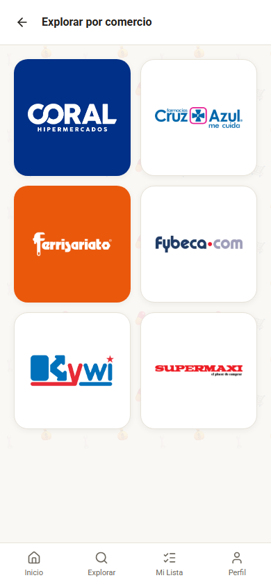 |

**Corrección**: placa blanca por defecto (funciona para logos a color), y una lista fija y corta de excepciones (`comercioLogoEsBlanco`, con Coral y Ferrisariato — los dos únicos logos en blanco puro) que sí reciben la placa de color de marca. En esa misma corrección se aprovechó para simplificar Landing y Explorar por Comercio a "solo logo" (sin nombre en texto al lado), tras confirmar que el logo por sí solo ya identifica al comercio.

Fallback verificado interceptando la red para forzar que las imágenes fallen — cae al emoji + chip de color original, sin cambios visuales respecto al diseño previo:

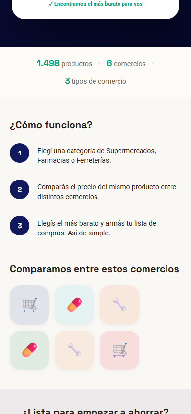

### 3.12 Acceso al Django Admin desde Perfil

El backend ya devolvía `is_staff` en login/register; se confirmó que el mapeo a la entidad de dominio (`LoggedUser.isStaff`) ya existía de una sesión anterior, así que este bloque fue solo UI: una opción condicional en Perfil, renderizada solo si `isStaff === true`, que abre `/admin/` en una pestaña nueva con `window.open(url, '_blank', 'noopener,noreferrer')`.

Sin credenciales de un usuario admin real disponibles, se verificó el camino "staff" interceptando la respuesta *real* de `/auth/register/` y forzando `is_staff: true` en el JSON de respuesta — ejercitando el adapter y el store reales de punta a punta, no solo la UI:

| Botón visible solo para staff | Abre el login propio de Django, sin auto-login |
|---|---|
| 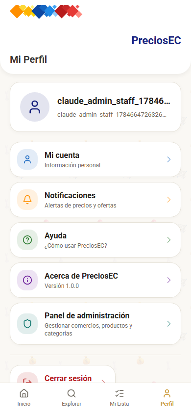 | 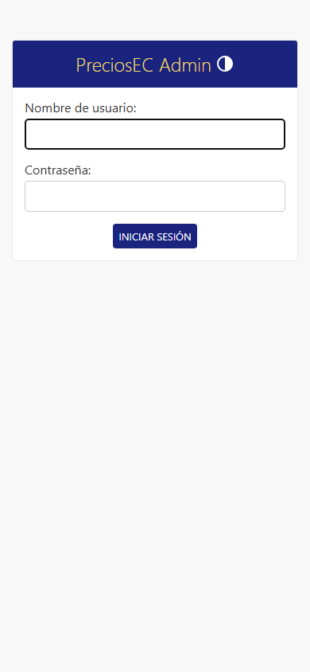 |

### 3.13 Precios y Mi Lista adaptados a desktop, y panel compartido de Login/Register

Dos piezas de trabajo relacionadas:

- **Precios**: el CTA fijo "Ir a mis listas de compras" se estiraba de punta a punta del viewport en desktop (porque estaba anclado al shell ancho, no al contenedor de 1280px). Se corrigió envolviéndolo en `lg:max-w-7xl lg:mx-auto lg:px-8` — confirmado con `boundingBox()` que quedó con 112px de margen simétrico a cada lado. Las tarjetas de comparación pasaron a `lg:grid-cols-2`.
- **Mi Lista**: los grupos por comercio pasaron a `lg:grid-cols-2` en vez de una columna ancha — justificado porque cada grupo es una tarjeta de ancho de contenido acotado (nombre + lista corta de productos), y estirarla a 1216px hubiera dejado demasiado espacio vacío.
- **Login/Register**: en vez de duplicar la lógica de la tarjeta animada de precio entre landing y las dos pantallas de auth, se extrajo a un componente compartido (`TarjetaPrecioDestacado`, con su propio fetch) y se creó `AuthHeroPanel` (panel navy reutilizado por Login y Register, con mensaje parametrizable) para no duplicar tampoco el layout de 2 columnas entre ambas pantallas.

| Precios — desktop (CTA ya no estirado) | Mi Lista — desktop (grid de 2 columnas) | Login — desktop (panel compartido) |
|---|---|---|
| 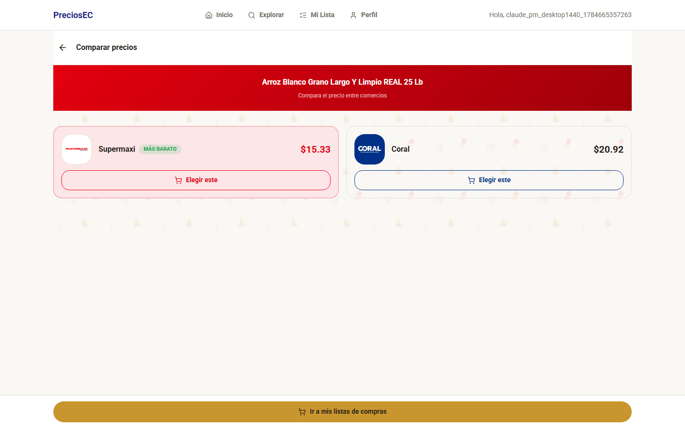 | 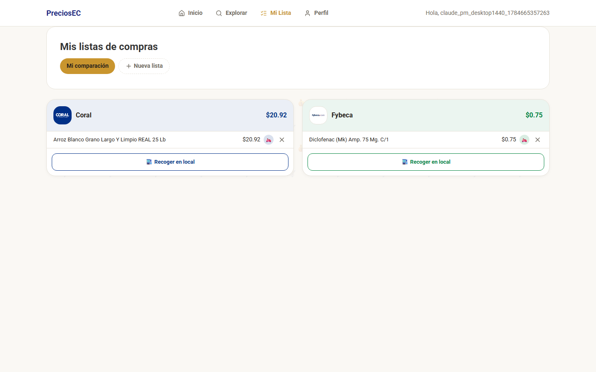 | 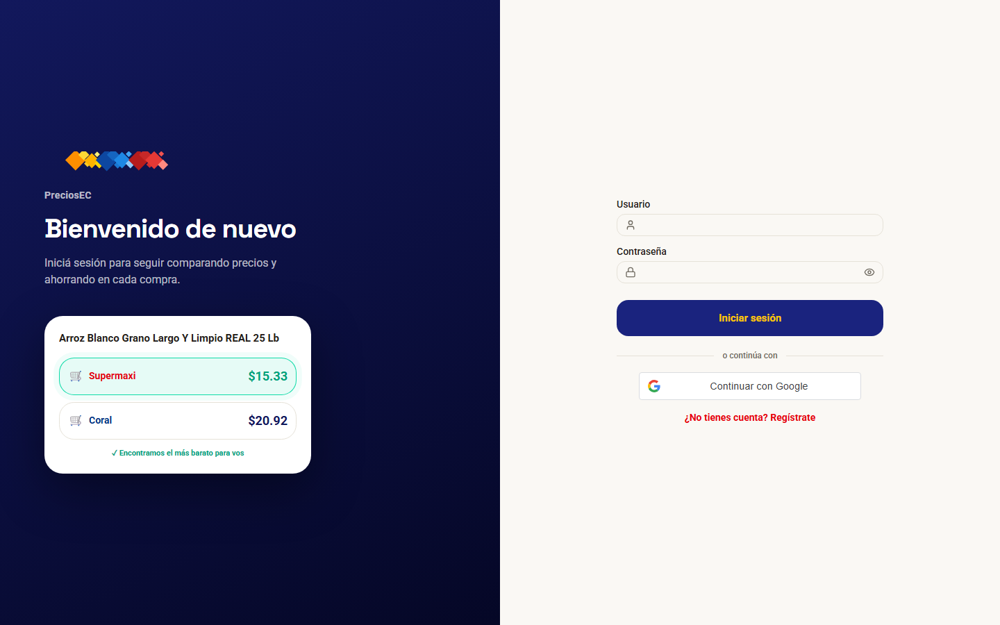 |

Se verificó el flujo de autenticación real de punta a punta tras el rediseño (no solo el layout): registro nuevo → Home, y login con sesión limpia → Home, confirmando que el rediseño visual no rompió el submit del formulario.

### 3.14 Sección "Compará estos productos ahora" en Home

La gran mayoría del catálogo tiene solo 1 comercio con precio — para que la demo (y el usuario real) vea la comparación funcionando sin depender de que la búsqueda encuentre uno de los pocos casos reales al azar, se agregó una sección con 5 IDs de producto confirmados por consulta directa (`curl`) con exactamente 2 comercios comparables cada uno (`IDS_PRODUCTOS_DESTACADOS = [224, 179, 608, 748, 211]`, documentados con un comentario explicando por qué existen).

De paso, se extrajo `ProductoCard` (que vivía privado dentro de `catalog-page.tsx`) a un componente compartido, para no duplicarlo entre Catalog y esta nueva sección.

| Desktop — 5 productos en una fila | Click en una tarjeta → Precios con 2 comercios reales |
|---|---|
| 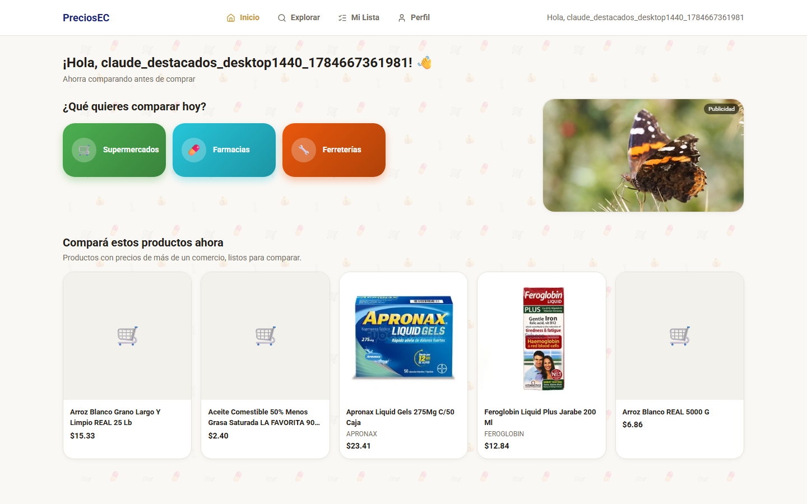 | 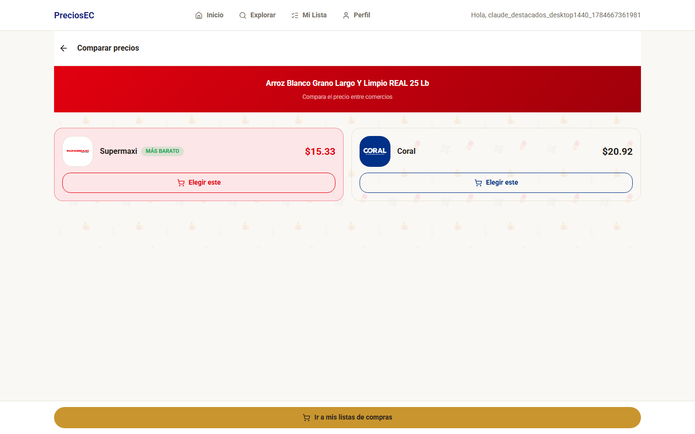 |

### 3.15 Eliminar lista de comparación

Antes de construir, se verificó con `curl` (crear una lista real, borrarla, confirmar `204`) que `DELETE /kache/listas-comparacion/<id>/` funcionaba. Se construyó el flujo completo (puerto → adapter → caso de uso → store → UI), con un modal de confirmación calcado del patrón ya existente en Perfil ("¿Seguro que...?").

Caso especial manejado explícitamente: si se elimina la lista *activa*, el store cambia automáticamente a otra lista existente (trayendo su detalle real); si no queda ninguna, reproduce el mismo estado vacío que ve un usuario que nunca creó una lista — no un estado nuevo e inconsistente.

| Modal de confirmación | Estado tras eliminar la última lista |
|---|---|
| 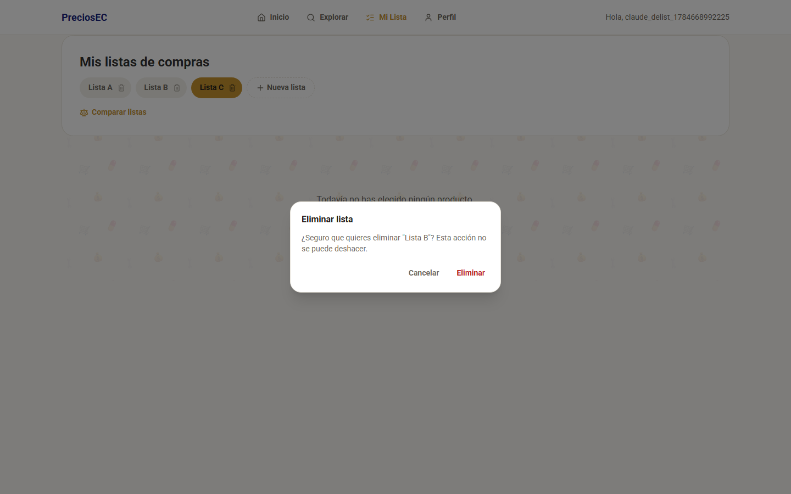 | 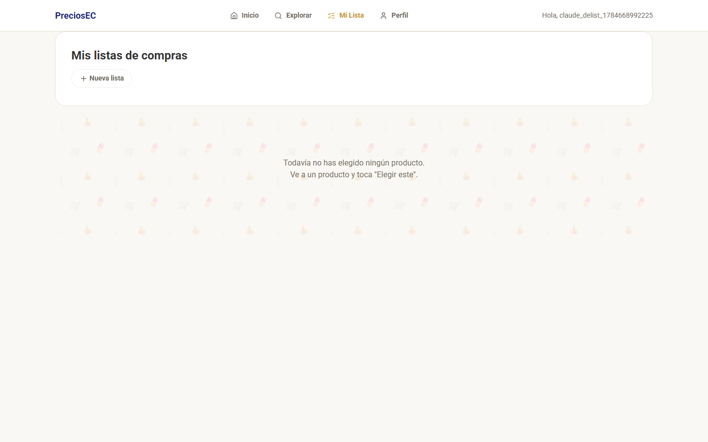 |

### 3.16 Renombrar lista — bloqueado y luego desbloqueado por el backend

Al pedir esta feature junto con "eliminar", se verificó primero con `curl`: `DELETE` funcionaba (204), pero **`PATCH` y `PUT` devolvían 405** ("Método no permitido"). Se decidió, con el usuario, construir solo "eliminar" en ese momento y dejar "renombrar" pendiente — en vez de construir una UI para una operación que el backend rechazaría en producción.

Sesión después, con el backend ya actualizado (confirmado de nuevo con `curl`: `PATCH` ahora devuelve `200` y actualiza el nombre), se completó la feature: input in-place con foco automático (Enter o blur confirma, Escape cancela, nombre vacío se descarta revirtiendo al anterior).

**Bug de UX encontrado en la propia verificación**: la primera versión del input in-place usaba `bg-transparent` + `outline-none`, quedando visualmente indistinguible del texto estático — nada indicaba que se podía editar. Se corrigió con un borde punteado y fondo claro que se resalta al enfocar.

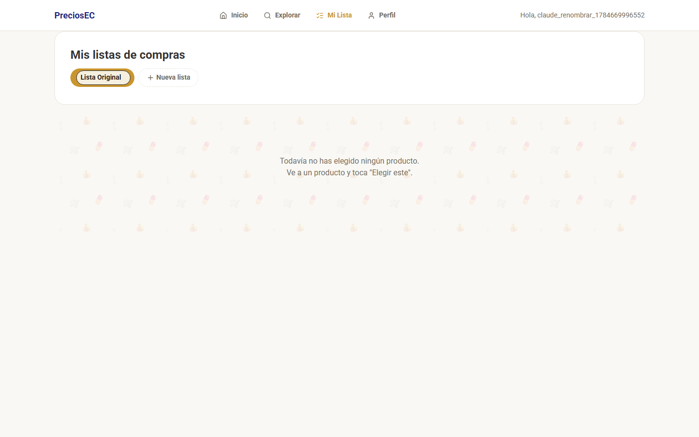

Verificado que el cambio persiste tras recargar la página (prueba de que el backend lo guardó de verdad, no solo el estado local de React).

### 3.17 Título de pestaña y favicon

Cambios finales, sin lógica: `<title>` pasó de "ract_comparador" (nombre de carpeta por defecto de Vite) a "PreciosEC — Compara precios antes de comprar", con meta description agregada. El favicon default de Vite (rayo violeta) se reemplazó por una grilla 2×3 de rombos rotados 45°, usando la misma paleta de colores que la tira de rombos del logo (`TiraRombosCentrada`) — condensada a un ícono cuadrado, ya que la tira original es una franja horizontal de 18 rombos, demasiado ancha y detallada para leerse a tamaño de pestaña.


---

## 4. Bugs reales, con causa raíz

| Bug | Síntoma | Causa raíz | Por qué se resolvió así |
|---|---|---|---|
| Bottom nav "flotando" | El nav parecía moverse con el scroll en vez de quedar fijo | Doble scroll: el `fixed` vivía dentro de un contenedor que también scrolleaba, y ese mismo contenedor era su containing block (por tener `transform`) | `overflow: hidden` en `html/body` eliminó el scroll doble; más adelante (bloque 1 responsive) se generalizó separando "quién es containing block" de "quién scrollea" en dos `div` anidados, para que la solución sobreviviera a la navbar de escritorio |
| Registro rompía la navegación / botón de Google no respondía | El overlay invisible de Google interceptaba clicks fuera de su área visual esperada | Iframe cross-origin posicionado con CSS sobre un botón visual — técnica frágil por naturaleza | Se abandonó el overlay en vez de parchearlo; el `<GoogleLogin>` real, sin trucos, no tiene ese problema |
| Key duplicada en React al paginar Explorar por Comercio | Warning de consola al scrollear profundo | El backend pagina por offset sin orden 100% estable: un mismo `id_precio` puede aparecer en dos páginas consecutivas (confirmado con `curl` recorriendo las 12 páginas reales) | Deduplicación defensiva por `id` en el cliente al acumular páginas, en vez de depender de que el backend lo resuelva — aplicada en los dos stores que comparten el patrón de paginación |
| Logo de Supermaxi ilegible | Texto rojo sobre placa de color de marca (también roja) | Placa de color de marca aplicada uniformemente a todos los logos, sin considerar que algunos ya tienen su propio color | Placa blanca por defecto + lista corta y explícita de excepciones (logos blancos puros), en vez de intentar detectar automáticamente el contraste de cada logo |
| Input de renombrar lista parecía texto estático | Nada indicaba que el campo era editable | `bg-transparent` + `outline-none` sin ningún otro indicador visual | Borde punteado + fondo claro distinguible del pill de fondo |

---

## 5. Decisiones revertidas o cambiadas de rumbo

- **`useGoogleLogin` en vez de `<GoogleLogin>`**: descartado antes de implementar, tras verificar en los tipos reales que no puede producir `id_token`. Documentado en detalle en §3.1.
- **Botón de Google con overlay invisible**: implementado, probado por el usuario en navegador real, y revertido tras reportarse dos bugs. Se volvió al componente real y visible. Documentado en §3.1.
- **Marquee continuo de comercios en la landing**: implementado como parte del rediseño visual, y reemplazado poco después por una entrada en cascada al notarse que, con solo 6 comercios reales, el movimiento continuo no aportaba información. Se eliminó explícitamente el código muerto (keyframes, clase CSS, duplicación de la lista) en vez de dejarlo sin usar. Documentado en §3.8.
- **Placa de color de marca para todos los logos de comercio**: implementado, y corregido a los pocos días tras encontrarse el problema de contraste con Supermaxi. Se pasó a placa blanca por defecto + excepción explícita para los 2 logos blancos conocidos. Documentado en §3.11.
- **Renombrar lista de comparación**: pedido junto con "eliminar lista", pero pospuesto una sesión completa porque el backend todavía no soportaba `PATCH`/`PUT` en ese endpoint (confirmado con `curl`, no supuesto). Se completó recién cuando el backend lo habilitó. Documentado en §3.16.

---

## 6. Limitaciones conocidas y trabajo pendiente

- **Cobertura de productos con comparación real es muy baja**: de todo el catálogo (~1.498 productos), la gran mayoría tiene precio en un solo comercio. Solo se tienen confirmados 6 productos con exactamente 2 comercios comparables (`224`, `179`, `608`, `748`, `211`, más el usado en la landing). No hay ningún producto confirmado con 3 o más comercios. La sección "Compará estos productos ahora" en Home existe específicamente para compensar esto en la demo — pero es un parche de contenido, no una solución al hecho de que la comparación real todavía cubre una fracción mínima del catálogo.
- **Explorar (búsqueda) no se rediseñó como grilla en desktop**, a propósito — se mantuvo como lista vertical acotada, ver §3.10. Esto es una decisión de diseño documentada, no una omisión.
- **Renombrar lista dependió de un cambio de backend fuera de este repositorio** — el frontend estuvo listo desde antes, bloqueado por un `405` real. Vale la pena confirmar periódicamente que otros endpoints de escritura (ej. edición de items, no solo de listas) no tengan la misma limitación no documentada.
- **Testing de Google OAuth con Playwright no es posible**: Google bloquea activamente flujos automatizados. Cualquier cambio futuro al botón de Google requiere verificación manual en navegador real, no puede confiarse en un test automatizado para ese flujo específico.
- **Historial anterior sin documentar** (ver §2): Mi Lista básica, comparación de múltiples listas, Perfil, ofertas, delivery por ítem, y la paginación temprana de Catalog/Explorar tienen evidencia visual guardada pero ningún registro de las decisiones, alternativas o bugs de esa etapa.
- **La discrepancia transitoria de `logo_url` entre el endpoint de lista y el de detalle de comercios** (§3.11) se resolvió sola con un deploy del backend durante la propia sesión de verificación — no se aplicó ningún workaround del lado del frontend. Si reaparece, la causa más probable es una inconsistencia entre el serializer de lista y el de detalle en el backend, no un bug de este repositorio.

## Nota de aclaración sobre el alcance de este documento

Este documento fue generado por una sesión de Claude Code con visibilidad 
limitada a lo que se le pidió directamente en su propia ventana de trabajo. 
Algunas tareas mencionadas como "pendientes" o "no verificadas" en este 
documento (por ejemplo, la subida real de los logos de comercio a 
Cloudflare R2 y su verificación en producción, o la aplicación de la 
jerarquía de categorías 8/9/10) se completaron efectivamente en otras 
sesiones de trabajo — realizadas por comandos directos vía SSH contra el 
servidor de producción y verificación externa, fuera del alcance que esta 
instancia particular pudo observar. Se mantiene la redacción original sin 
modificar por transparencia sobre lo que esa sesión pudo confirmar 
directamente, pero se deja esta aclaración para que no se lea como un 
pendiente real al día de hoy.